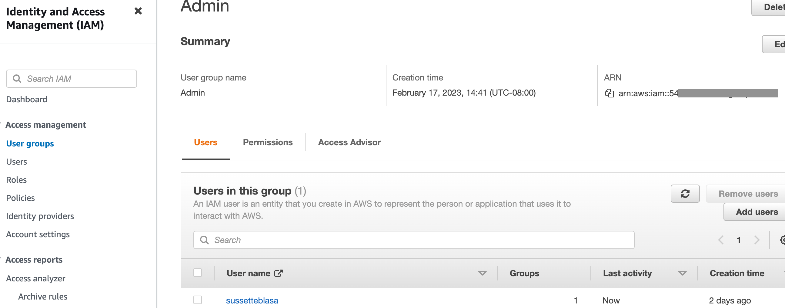
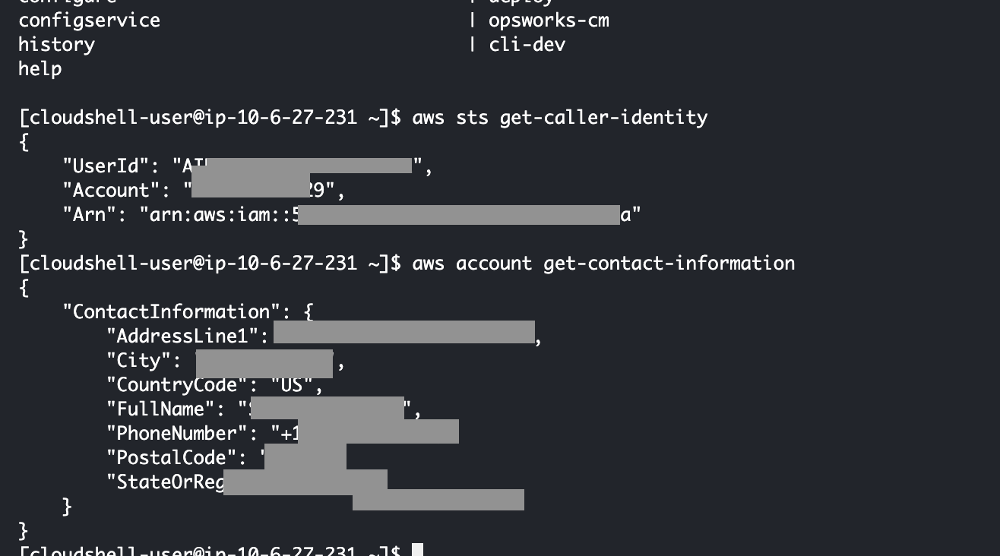
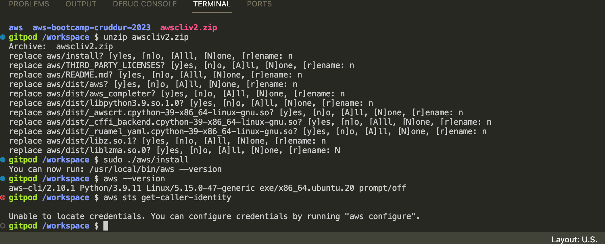
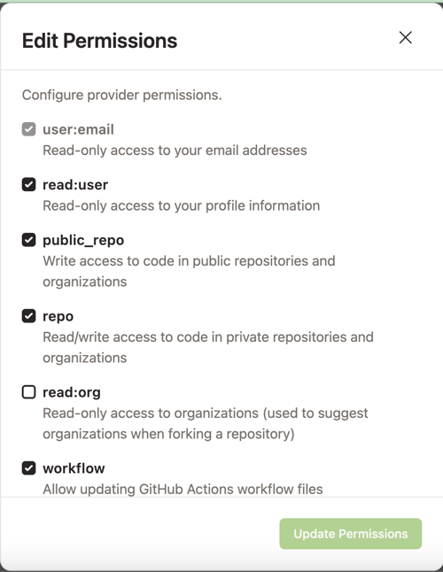

# Week 0 — Billing and Architecture

## Required Homework

### Created LucidChart Diagrams

[Conceptual and Logical Diagrams - lucidchart link](https://lucid.app/lucidchart/aa9990f6-e027-439a-8b9c-319736fe2f68/edit?viewport_loc=-98%2C300%2C2434%2C1141%2C0_0&invitationId=inv_24aa1449-1320-42a7-8650-ad8f36ff9a23)

This link contains both the conceptual and logical diagrams, the logical is on the next page within the document.

I thought it was pretty cool that the AWS icons were available in LucidChart. Also, I didn't realize that there were different versions of the AWS images, and some were older than the others, so I'll make sure I use the most current my presentations which concern AWS.

Also, I don't know too much about SVGs, so that explanation about it was helpful. I didn't know you could do that--save it as a file, and then import it somewhere. 

## Created AWS Admin IAM user in Admin Group

This part was easy. I had forgotten to generate the keys after I created the IAM user, so I went back to IAM page and generated the key. 

I haven't generated the MFA yet because I'm trying to clean up my Authy MFA app since I messed it up last time with my other AWS account that I created last year. I had switched phones, and forgot that I had my AWS MFA configured there. Not good. You don't want to be contacting AWS support on a Sunday evening to see if you can get account access. I mean he was pretty nice, but the support rep had said it would take a few days to confirm who I was before I could get my account access back. Ugh, what? I'm looking for the crying emoji, but since I'm a n00b with markdown, I'll just have to put in a table flip emoji. (┛ಠ_ಠ)┛彡┻━┻ (I use these quite often at work with my co-workers when there's a production issue, or just for fun.)

Fortunately, I forgot I had installed the Authy application on my desktop as well, so I had the AWS account configured there too. I contacted support back to let them know to stand down. I got my access back, so no need to do a background check (google) on me to see if I was who I claimed to be. ┳━┳ ヽ(ಠل͜ಠ)ﾉ (This is putting the tables back emoji.)

## Using Cloudshell

I've never had the opportunity to use cloud shell. I don't know how often I would use it, but it would be good to know that I have this tool available.
 

This also allowed me to see the different commands that are avaialable for the AWS CLI. At work, I usually use the AWS SDK with the IDE that I use, more than the AWS CLI. Of course, that could change. Thankfully, I didn't have any issues using CloudShell, except the spelling of CloudShell, which I thought was spelled "Cloudshell", but I guess the marketing/product people had other ideas.

## Generate AWS Credentials
As I mentioned earlier, I forgot to generate the AWS credentials when I created my admin IAM user, so I went back into the IAM user that I used and generated the secret and key. There wasn't much to do there, aside from making sure I didn't delete the key and secret. 

## Install AWS CLI

I was able to install AWS CLI in Gitpod. 

At first, I came across an error, but I saw in the instructional video showed how to fix the error. I forgot to set my environment variables in gitpod, so it was coming up with an "unable to locate credentials" error message. Oops forgot to set those. Cutting and pasting the code was problem because it was concatenating the strings of the three environment variables together.

Later, I was unable to commit at first because I had the permissions settings for Gitpod set incorectly for my Github repo. 
I had to set it to this in the screenshot below.

Okay, so I got distracted by other things (life), and so my gitpod workspace would time out, and then I had to finish reinstalling AWS CLI.
